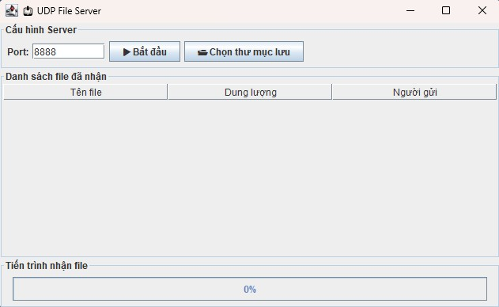
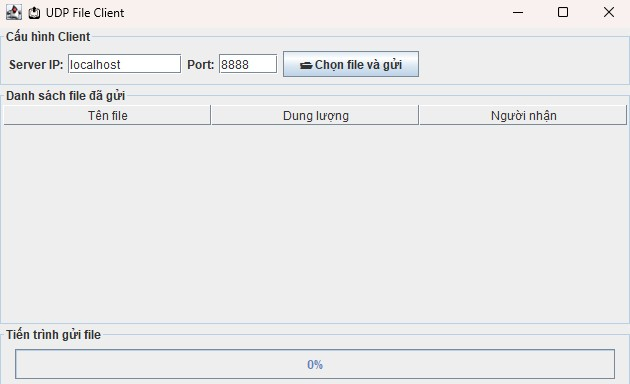

<h2 align="center">
    <a href="https://dainam.edu.vn/vi/khoa-cong-nghe-thong-tin">
    🎓 Faculty of Information Technology (DaiNam University)
    </a>
</h2>
<h2 align="center">
    TRUYỀN FILE QUA UDP 
</h2>

    

        
        
        
    

#  📖  1. Giới thiệu
Đề tài minh hoạ cách xây dựng một ứng dụng **truyền file qua giao thức UDP** dựa trên mô hình **Client/Server**.  
Ứng dụng cho phép:

- Client chia nhỏ file thành nhiều gói tin và gửi tới Server.  
- Server nhận, ghép lại các gói tin và lưu thành file hoàn chỉnh.  
- Minh họa lập trình mạng với **UDP socket** trong Java.  

---

# 🔧 2. Ngôn ngữ lập trình sử dụng
**Java**

Công nghệ sử dụng:
- **Java Swing** (tạo giao diện)  
- **UDP DatagramSocket** (truyền dữ liệu)  

---

# 🚀 3. Các chức năng chính
- Client chọn nhiều file và gửi tới Server qua UDP socket.  
- File được chia nhỏ thành nhiều gói tin và truyền đi.  
- Server nhận, ghép lại và lưu file vào thư mục chỉ định.  
- Hiển thị tiến trình gửi/nhận file qua **JProgressBar**.  
- Giao diện trực quan bằng **Java Swing**.  

### 👉 Có thể mở rộng:
- Cơ chế kiểm tra mất gói và gửi lại.  
- Truyền nhiều file liên tiếp.  
- Mã hoá dữ liệu trước khi gửi.  

## 🖼️ 4. Giao diện minh họa

### Client (gửi file) 📤

    

        
        

### Server (nhận file) 📥

    

        
        

---

## 5. Cách chạy chương trình

### 1️⃣ Chạy Server
- Mở `UDPFileServerGUI.java`  
  
- Bấm **Chọn thư mục lưu** để chỉ định nơi nhận file (Nếu không chọn nơi lưu trữ, thư mục sẽ được lưu tại thư mục gốc *Nơi lưu trữ Ứng dụng*)  
- Nhấn ****

### 2️⃣ Chạy Client
- Mở `UDPFileClientGUI.java`  

- Chọn file cần gửi và nhấn **Gửi**
- Nhập Port (mặc định: 0000)

---

## 📌 Ghi chú
- Server phải được khởi động **trước** khi Client gửi file.  
- Nếu chưa chọn thư mục lưu, file sẽ được lưu ngay tại thư mục chạy chương trình.  
- UDP không đảm bảo toàn vẹn gói tin → chỉ phù hợp để demo, với file nhỏ/medium.  

---

## 👤 Thông tin cá nhân
- **Nguyễn Tuấn Anh – CNTT 16-04  
- 📧 Email: tuananh12cpt@gmail.com  

