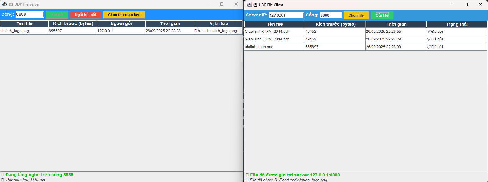

    <a href="https://dainam.edu.vn/vi/khoa-cong-nghe-thong-tin">
    🎓 Faculty of Information Technology (DaiNam University)
    </a>
</h2>
<h2 align="center">
    TRUYỀN FILE QUA UDP 
</h2>

    

        
        
        
    

#  📖  1. Giới thiệu
Đề tài minh hoạ cách xây dựng một ứng dụng **truyền file qua giao thức UDP** dựa trên mô hình **Client/Server**.  
Ứng dụng cho phép:

- Client chia nhỏ file thành nhiều gói tin và gửi tới Server.  
- Server nhận, ghép lại các gói tin và lưu thành file hoàn chỉnh.  
- Minh họa lập trình mạng với **UDP socket** trong Java.  

---

# 🔧 2. Ngôn ngữ lập trình sử dụng
**Java**

Công nghệ sử dụng:
- **Java Swing** (tạo giao diện)  
- **UDP DatagramSocket** (truyền dữ liệu)  

---

## 🖼️ 3. Giao diện minh họa

### Client (gửi file) 📤

    

        

Giao diện của Client chưa nhận file
  

### Server (nhận file) 📥

    

        
        

Giao diện của server chưa nhận file  

### Chọn thư mục lưu trữ trên Client nhận file 📥

    

        
        

Giao diện của Client gửi file qua cho Server  

 ### Ảnh kết quả khi chương trình nhận thành công 📥
 

    

        
        

 Ảnh kết quả gửi file và lịch sử file đã được gửi 

## 4. Cách chạy chương trình

### 1️⃣ Chạy Server
- Mở `UDPServer.java`  
  
- Bấm **Chọn thư mục lưu** để chỉ định nơi nhận file (Nếu không chọn nơi lưu trữ, thư mục sẽ được lưu tại thư mục gốc *Nơi lưu trữ Ứng dụng*)  
- Nhấn bắt đầu
- Tiếp đó ta nhấn kết nối( góc trái dưới màn hình nó hiện đã kết nối & ổ lưu trữ nhận
- Khi bên Client gửi file thì bên Server nhận sẽ hiển thị: Tên file - kích thước - người gửi - thời gian - vị trí lưu

### 2️⃣ Chạy Client
- Mở `UDPClient.java`  
- Server IP: 127.0.0.1
- Nhập Port (mặc định: 8888)
- Đầu tiên chúng ta chọn file sau khi chọn file mong muốn gửi sang nơi nhận ta bấm gửi
- Khi ta bấm gửi file thì ở dưới hiện Tên file - kích thước file - Thời gian - trạng thái 

---

## 📌 Ghi chú
- Server phải được khởi động **trước** khi Client gửi file.  
- Nếu chưa chọn thư mục lưu, file sẽ được lưu ngay tại thư mục chạy chương trình.  
- UDP không đảm bảo toàn vẹn gói tin → chỉ phù hợp để demo, với file nhỏ/medium.  

---

## 5. 👤 Thông tin cá nhân
- **Nguyễn Tuấn Anh – CNTT 16-04  
- 📧 Email: tuananh12cpt@gmail.com  

